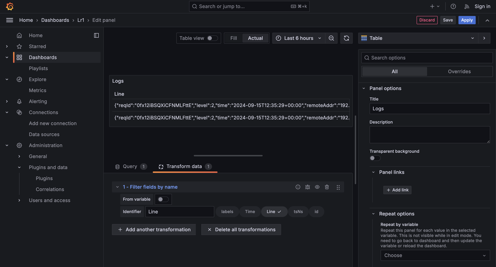
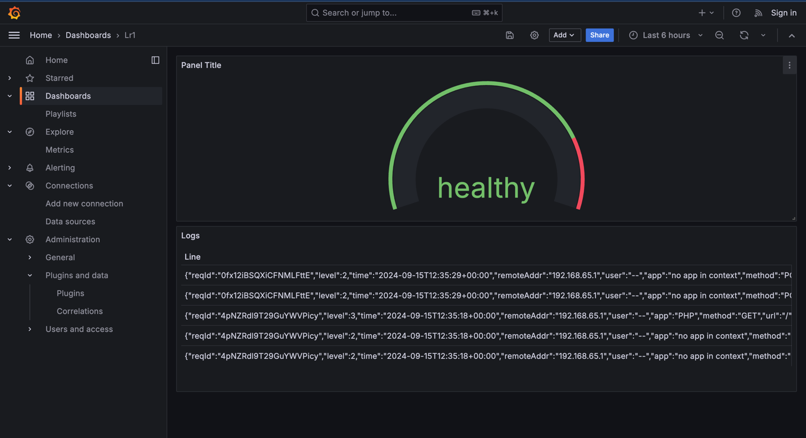

# Лабораторная работа №1

Как делал:

Результат работы:

## Вопросы

1. *Чем SLO отличается от SLA?*
- SLA - это соглашение, формализует цели и метрики. SLO - это SLI, которое мы хотим достичь
2. *Чем отличается инкрементальный бэкап от дифференциального?*
- Стратегия дифференциального резервного копирования копирует только изменения данных с момента последнего полного резервного копирования. Стратегия инкрементного резервного копирования данных копирует изменения данных с момента последнего резервного копирования.
3. *В чем разница между мониторингом и observability?*
- Мониторинг обычно оценивает состояние конкретной системы. Благодаря observability мы получаем общее представление о взаимозависимостях в системе.