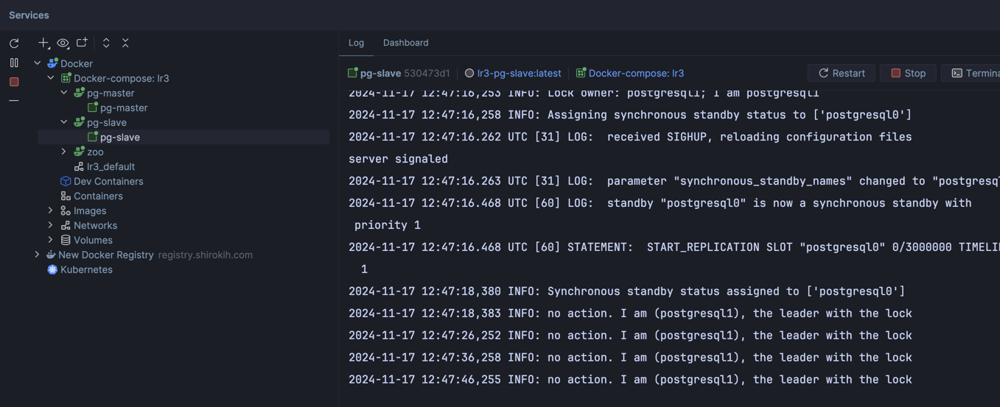
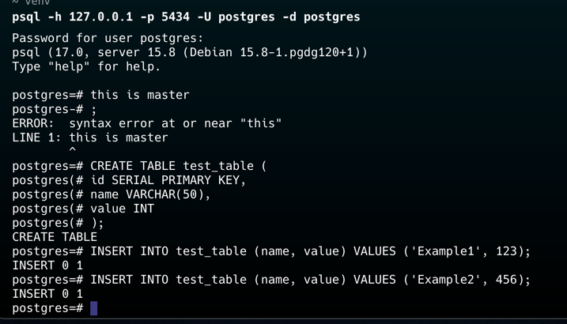
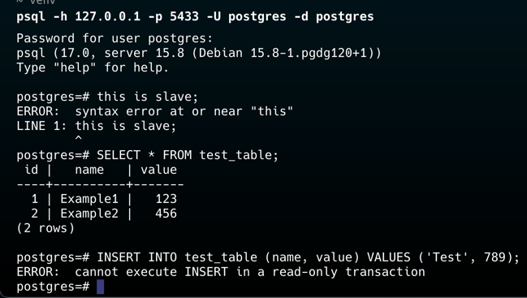
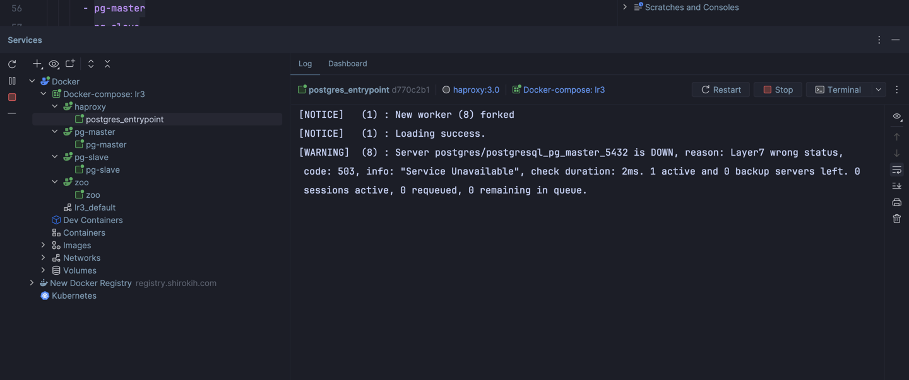
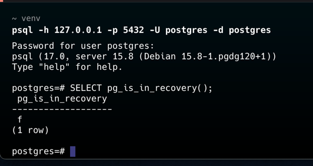
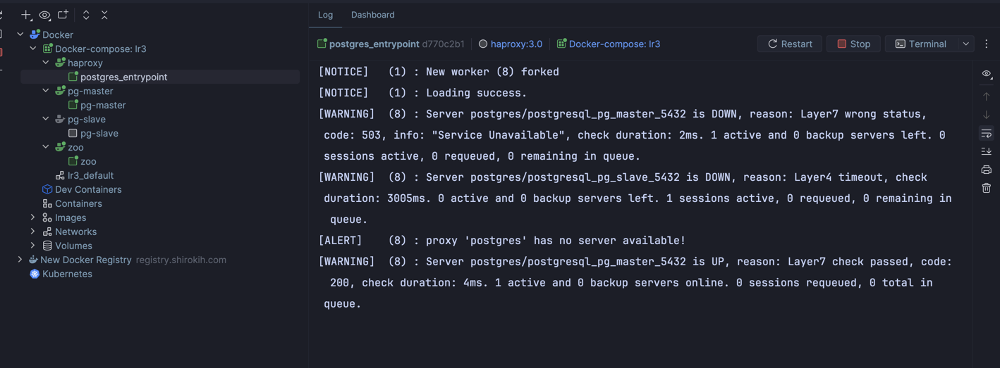
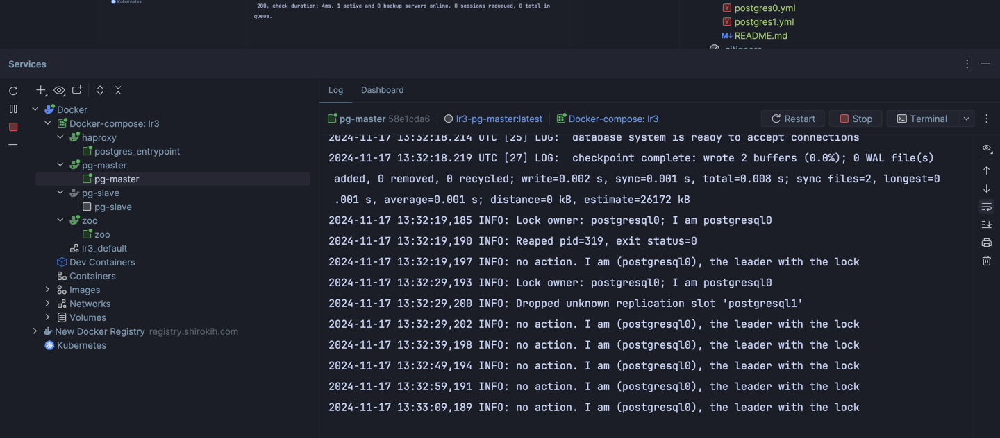
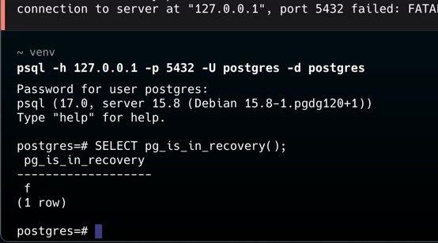

# Лабораторная работа №3

Первый пункт - собрал инфраструктуру. И кстати слейв по факту мастер.

Второй пункт - репликация работает, и в слейв ноду нельзя вставлять данные.

Третий пункт - ha прокси поднялся и перенаправляет трафик на мастера

Задание - уронил мастера и успешно патрони переключл роль на слейва, ха прокси тоже подтянулся.

## Вопросы

1. *Порты 8008 и 5432 вынесены в разные директивы, expose и ports. По сути, если записать 8008 в ports, то он тоже станет exposed. В чем разница?*
- expose  — это о создании внутренней сети в пределах Docker Compose, где определенные порты доступны только между контейнерами. ports — это о фактическом маппинге портов для внешнего доступа c хоста.

2. *При обычном перезапуске композ-проекта, будет ли сбилден заново образ? А если предварительно отредактировать файлы postgresX.yml? А если содержимое самого Dockerfile? Почему?*
- При обычном перезапуске не будет перебилден. Файлы монтируются как тома, конфиграция самого патрона применится, но образы не перебилдятся. Надо использовать флаг --build для переборски 